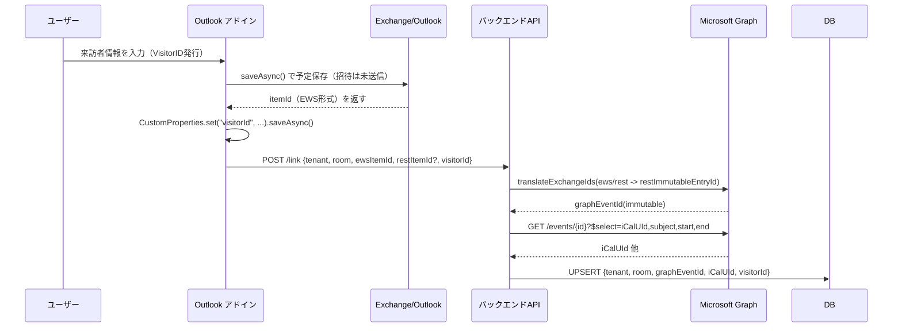
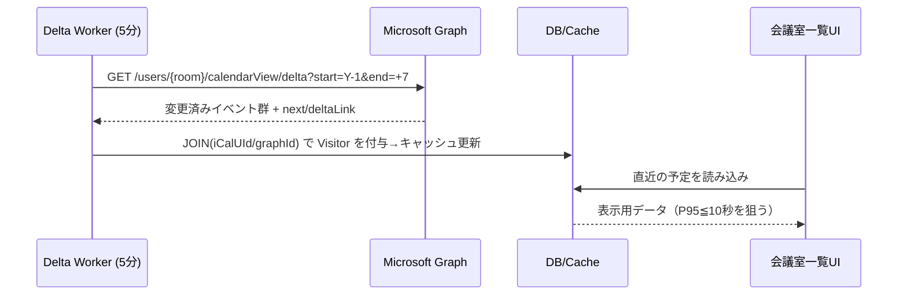

# VisitorID Graph Integration - Near Real-time Visitor Management

## 概要

このプロジェクトは、従来の「予定本文にVisitorIDを埋め込む」方式から脱却し、Microsoft Graph APIとOutlookアドインを活用して**準リアルタイムの来訪者管理システム**を構築するための基盤実装です。

### 従来の課題

- 予定の本文にVisitorIDを埋め込んでいたため、プレーンテキストで管理データが露出
- 30分バッチでの同期によりタイムラグが発生
- 全会議室の予定を毎回取得・並び替えするため、パフォーマンスに問題

### 新システムの特徴

- **CustomPropertiesによる非表示データ保存**: アドイン内でVisitorIDを隠蔽して保存
- **5分間隔のDelta同期**: Microsoft Graph Delta APIで効率的な差分取得
- **本文依存の解消**: 構造化されたデータ管理によるセキュリティ向上
- **準リアルタイム更新**: キャッシュベースの高速表示とバックグラウンド同期

## アーキテクチャ

### システム構成

```text
┌─────────────────┐    ┌──────────────────┐    ┌─────────────────┐
│   Outlook       │    │   Backend API    │    │  Delta Worker   │
│   Add-in        │    │  (ASP.NET Core)  │    │ (Azure Functions│
│  (TypeScript)   │    │                  │    │   Timer)        │
└─────────────────┘    └──────────────────┘    └─────────────────┘
        │                        │                        │
        │  1. POST /link         │                        │
        └────────────────────────┤                        │
                                 │  2. TranslateIds       │
                                 │     + DB UPSERT        │
                                 │                        │
                                 │                        │ 3. Delta API
                                 │                        │    (5分間隔)
                                 │                        └────────────┐
                                 │                                     │
                                 ▼                                     ▼
                    ┌─────────────────────────┐         ┌─────────────────────┐
                    │     Database           │         │   Microsoft Graph   │
                    │  (Visitor + Events)    │         │        API          │
                    └─────────────────────────┘         └─────────────────────┘
```

### フロー概要

#### 1. 予定作成・VisitorID登録



#### 2. 5分間隔Delta同期



## セットアップ

### 前提条件

1. **Azure環境**

   - Azure Functions (v4, .NET 8.0)
   - Azure App Service または適切なホスティング環境
   - Microsoft Graph API権限

2. **Microsoft Graph権限**

   ```text
   - Calendars.Read (全会議室)
   - Calendars.ReadWrite (ID変換・拡張プロパティ用)
   - Directory.Read.All (ユーザー/リソース解決用)
   ```

3. **開発環境**

   - .NET 8.0 SDK
   - Node.js (アドイン開発用)
   - Visual Studio または VS Code

### インストール手順

#### 1. バックエンドAPI（server-dotnet）

```bash
cd server-dotnet
dotnet restore
dotnet run
```

**設定:**

- **Azure認証**: `DefaultAzureCredential`を使用
- **Graph権限**: アプリケーション権限またはOBOフロー

#### 2. Delta Worker（Azure Functions）

```bash
cd worker-dotnet
dotnet restore
func start  # ローカル実行の場合
```

**環境変数:**

```bash
# 監視対象の会議室（UPN形式）
ROOM_UPNS="room1@contoso.com,room2@contoso.com"

# Delta同期の時間窓
WINDOW_DAYS_PAST=1     # 過去何日まで
WINDOW_DAYS_FUTURE=7   # 未来何日まで
```

**Timerトリガー:**

- **頻度**: `0 */5 * * * *` (5分間隔)
- **タイムゾーン**: `Tokyo Standard Time`

#### 3. Outlookアドイン（addin）

```bash
cd addin
npm install
npm run build
```

**主要関数:**

```typescript
// VisitorIDを予定に紐付け
await attachVisitor(
  "tenant-id",
  "room@contoso.com", 
  "generated-visitor-id",
  "https://your-backend.com"
);
```

## API仕様

### POST /link

予定とVisitorIDの紐付けを行う

**Request Body:**

```json
{
  "tenantId": "your-tenant-id",
  "roomUpn": "room@contoso.com",
  "ewsItemId": "AAMkAD...",
  "restItemId": "AAMkAD...",
  "visitorId": "visitor-12345"
}
```

**Response:**

- `202 Accepted`: 正常に処理された
- エラー時は適切なHTTPステータスコード

### DB Schema（参考）

```sql
-- 予定とVisitorIDのマッピング
CREATE TABLE EventVisitorMapping (
    TenantId NVARCHAR(255) NOT NULL,
    RoomUpn NVARCHAR(255) NOT NULL,
    GraphEventId NVARCHAR(255) NOT NULL,
    ICalUId NVARCHAR(255),
    VisitorId NVARCHAR(255) NOT NULL,
    CreatedAt DATETIME2 DEFAULT GETUTCDATE(),
    UpdatedAt DATETIME2 DEFAULT GETUTCDATE(),
    
    PRIMARY KEY (TenantId, RoomUpn, GraphEventId)
);

-- Deltaキャッシュ（パフォーマンス向上用）
CREATE TABLE EventCache (
    TenantId NVARCHAR(255) NOT NULL,
    RoomUpn NVARCHAR(255) NOT NULL,
    GraphEventId NVARCHAR(255) NOT NULL,
    Subject NVARCHAR(500),
    StartDateTime DATETIME2,
    EndDateTime DATETIME2,
    VisitorId NVARCHAR(255),
    LastSyncAt DATETIME2 DEFAULT GETUTCDATE(),
    
    PRIMARY KEY (TenantId, RoomUpn, GraphEventId)
);
```

## 制限事項・パフォーマンス

### Microsoft Graph制限

- **Delta API**: 会議室ごとに直列処理
- **Batch操作**: 最大20リクエスト/回
- **レート制限**: 429エラー時は`Retry-After`ヘッダーに従う

### パフォーマンス目標

- **UI表示**: P95 ≤ 10秒
- **同期遅延**: 最大5分
- **データ整合性**: 最終的一貫性

## 運用・監視

### ログ出力

- **Delta Worker**: 会議室ごとの同期結果
- **Backend API**: ID変換・DB更新の成否
- **Add-in**: CustomProperties保存の成否

### メトリクス監視

- Delta API呼び出し頻度・成功率
- DB UPSERT操作の実行時間
- キャッシュヒット率

## 開発・デバッグ

### ローカル開発

```bash
# Backend API
cd server-dotnet && dotnet run

# Azure Functions (Local)
cd worker-dotnet && func start

# Add-in (要Office.js環境)
cd addin && npm run build
```

### テスト用環境変数

```bash
# Azure認証（ローカル開発用）
export AZURE_CLIENT_ID="your-app-id"
export AZURE_CLIENT_SECRET="your-secret"
export AZURE_TENANT_ID="your-tenant-id"

# 監視対象会議室
export ROOM_UPNS="testroom@contoso.com"
```

## TODO・拡張予定

- [ ] **データベース実装**: 実際のDB接続とスキーマ
- [ ] **認証フロー**: OBOまたはSSO認証の実装
- [ ] **エラーハンドリング**: リトライ機構・Dead Letter Queue
- [ ] **メトリクス・監視**: Application Insights統合
- [ ] **UI実装**: 会議室一覧画面の実装
- [ ] **テスト**: ユニット・統合テストの追加

## ライセンス

MIT License

## 貢献

プルリクエストやイシューの報告を歓迎します。

---

**注意**: このプロジェクトはスキャフォールド（基盤実装）です。本番運用には、認証・エラーハンドリング・監視の実装が必要です。

## アーキテクチャ

### コンポーネント構成

```text
┌─────────────────┐    ┌──────────────────┐    ┌─────────────────┐
│   Outlook       │    │   Backend API    │    │  Delta Worker   │
│   Add-in        │    │  (ASP.NET Core)  │    │ (Azure Functions│
│  (TypeScript)   │    │                  │    │   Timer)        │
└─────────────────┘    └──────────────────┘    └─────────────────┘
        │                        │                        │
        │  1. POST /link         │                        │
        └────────────────────────┤                        │
                                 │  2. TranslateIds       │
                                 │     + DB UPSERT        │
                                 │                        │
                                 │                        │ 3. Delta API
                                 │                        │    (5分間隔)
                                 │                        └────────────┐
                                 │                                     │
                                 ▼                                     ▼
                    ┌─────────────────────────┐         ┌─────────────────────┐
                    │     Database           │         │   Microsoft Graph   │
                    │  (Visitor + Events)    │         │        API          │
                    └─────────────────────────┘         └─────────────────────┘
```

### データフロー

#### 1. 予定作成・VisitorID登録


#### 2. 5分間隔Delta同期


## セットアップ

### 前提条件

1. **Azure環境**

   - Azure Functions (v4, .NET 8.0)
   - Azure App Service または適切なホスティング環境
   - Microsoft Graph API権限

2. **Microsoft Graph権限**

   ```text
   - Calendars.Read (全会議室)
   - Calendars.ReadWrite (ID変換・拡張プロパティ用)
   - Directory.Read.All (ユーザー/リソース解決用)
   ```

3. **開発環境**

   - .NET 8.0 SDK
   - Node.js (アドイン開発用)
   - Visual Studio または VS Code

### 1. バックエンドAPI（server-dotnet）

```bash
cd server-dotnet
dotnet restore
dotnet run
```

#### 設定

- **Azure認証**: `DefaultAzureCredential`を使用
- **Graph権限**: アプリケーション権限またはOBOフロー

### 2. Delta Worker（Azure Functions）

```bash
cd worker-dotnet
dotnet restore
func start  # ローカル実行の場合
```

#### 環境変数

```bash
# 監視対象の会議室（UPN形式）
ROOM_UPNS="room1@contoso.com,room2@contoso.com"

# Delta同期の時間窓
WINDOW_DAYS_PAST=1     # 過去何日まで
WINDOW_DAYS_FUTURE=7   # 未来何日まで
```

#### Timerトリガー

- **頻度**: `0 */5 * * * *` (5分間隔)
- **タイムゾーン**: `Tokyo Standard Time`

### 3. Outlookアドイン（addin）

```bash
cd addin
npm install
npm run build
```

#### 主要関数

```typescript
// VisitorIDを予定に紐付け
await attachVisitor(
  "tenant-id",
  "room@contoso.com", 
  "generated-visitor-id",
  "https://your-backend.com"
);
```

## API仕様

### POST /link

予定とVisitorIDの紐付けを行う

**Request Body:**

```json
{
  "tenantId": "your-tenant-id",
  "roomUpn": "room@contoso.com",
  "ewsItemId": "AAMkAD...",
  "restItemId": "AAMkAD...",
  "visitorId": "visitor-12345"
}
```

**Response:**

- `202 Accepted`: 正常に処理された
- エラー時は適切なHTTPステータスコード

### DB Schema（参考）

```sql
-- 予定とVisitorIDのマッピング
CREATE TABLE EventVisitorMapping (
    TenantId NVARCHAR(255) NOT NULL,
    RoomUpn NVARCHAR(255) NOT NULL,
    GraphEventId NVARCHAR(255) NOT NULL,
    ICalUId NVARCHAR(255),
    VisitorId NVARCHAR(255) NOT NULL,
    CreatedAt DATETIME2 DEFAULT GETUTCDATE(),
    UpdatedAt DATETIME2 DEFAULT GETUTCDATE(),
    
    PRIMARY KEY (TenantId, RoomUpn, GraphEventId)
);

-- Deltaキャッシュ（パフォーマンス向上用）
CREATE TABLE EventCache (
    TenantId NVARCHAR(255) NOT NULL,
    RoomUpn NVARCHAR(255) NOT NULL,
    GraphEventId NVARCHAR(255) NOT NULL,
    Subject NVARCHAR(500),
    StartDateTime DATETIME2,
    EndDateTime DATETIME2,
    VisitorId NVARCHAR(255),
    LastSyncAt DATETIME2 DEFAULT GETUTCDATE(),
    
    PRIMARY KEY (TenantId, RoomUpn, GraphEventId)
);
```

## スロットリング・制限事項

### Microsoft Graph制限

- **Delta API**: 会議室ごとに直列処理
- **Batch操作**: 最大20リクエスト/回
- **レート制限**: 429エラー時は`Retry-After`ヘッダーに従う

### パフォーマンス目標

- **UI表示**: P95 ≤ 10秒
- **同期遅延**: 最大5分
- **データ整合性**: 最終的一貫性

## 運用・監視

### ログ出力

- **Delta Worker**: 会議室ごとの同期結果
- **Backend API**: ID変換・DB更新の成否
- **Add-in**: CustomProperties保存の成否

### メトリクス監視

- Delta API呼び出し頻度・成功率
- DB UPSERT操作の実行時間
- キャッシュヒット率

## 開発・デバッグ

### ローカル開発

```bash
# Backend API
cd server-dotnet && dotnet run

# Azure Functions (Local)
cd worker-dotnet && func start

# Add-in (要Office.js環境)
cd addin && npm run build
```

### テスト用環境変数

```bash
# Azure認証（ローカル開発用）
export AZURE_CLIENT_ID="your-app-id"
export AZURE_CLIENT_SECRET="your-secret"
export AZURE_TENANT_ID="your-tenant-id"

# 監視対象会議室
export ROOM_UPNS="testroom@contoso.com"
```

## TODO・拡張予定

- [ ] **データベース実装**: 実際のDB接続とスキーマ
- [ ] **認証フロー**: OBOまたはSSO認証の実装
- [ ] **エラーハンドリング**: リトライ機構・Dead Letter Queue
- [ ] **メトリクス・監視**: Application Insights統合
- [ ] **UI実装**: 会議室一覧画面の実装
- [ ] **テスト**: ユニット・統合テストの追加

## ライセンス

MIT License

## 貢献

プルリクエストやイシューの報告を歓迎します。

---

**注意**: このプロジェクトはスキャフォールド（基盤実装）です。本番運用には、認証・エラーハンドリング・監視の実装が必要です。

## アーキテクチャ

### コンポーネント構成

```text
┌─────────────────┐    ┌──────────────────┐    ┌─────────────────┐
│   Outlook       │    │   Backend API    │    │  Delta Worker   │
│   Add-in        │    │  (ASP.NET Core)  │    │ (Azure Functions│
│  (TypeScript)   │    │                  │    │   Timer)        │
└─────────────────┘    └──────────────────┘    └─────────────────┘
        │                        │                        │
        │  1. POST /link         │                        │
        └────────────────────────┤                        │
                                 │  2. TranslateIds       │
                                 │     + DB UPSERT        │
                                 │                        │
                                 │                        │ 3. Delta API
                                 │                        │    (5分間隔)
                                 │                        └────────────┐
                                 │                                     │
                                 ▼                                     ▼
                    ┌─────────────────────────┐         ┌─────────────────────┐
                    │     Database           │         │   Microsoft Graph   │
                    │  (Visitor + Events)    │         │        API          │
                    └─────────────────────────┘         └─────────────────────┘
```

### データフロー

#### 1. 予定作成・VisitorID登録


#### 2. 5分間隔Delta同期


## セットアップ

### 前提条件

1. **Azure環境**
   - Azure Functions (v4, .NET 8.0)
   - Azure App Service または適切なホスティング環境
   - Microsoft Graph API権限

2. **Microsoft Graph権限**

   ```text
   - Calendars.Read (全会議室)
   - Calendars.ReadWrite (ID変換・拡張プロパティ用)
   - Directory.Read.All (ユーザー/リソース解決用)
   ```

3. **開発環境**
   - .NET 8.0 SDK
   - Node.js (アドイン開発用)
   - Visual Studio または VS Code

### 1. バックエンドAPI（server-dotnet）

```bash
cd server-dotnet
dotnet restore
dotnet run
```

#### 設定
- **Azure認証**: `DefaultAzureCredential`を使用
- **Graph権限**: アプリケーション権限またはOBOフロー

### 2. Delta Worker（Azure Functions）

```bash
cd worker-dotnet
dotnet restore
func start  # ローカル実行の場合
```

#### 環境変数
```bash
# 監視対象の会議室（UPN形式）
ROOM_UPNS="room1@contoso.com,room2@contoso.com"

# Delta同期の時間窓
WINDOW_DAYS_PAST=1     # 過去何日まで
WINDOW_DAYS_FUTURE=7   # 未来何日まで
```

#### Timerトリガー
- **頻度**: `0 */5 * * * *` (5分間隔)
- **タイムゾーン**: `Tokyo Standard Time`

### 3. Outlookアドイン（addin）

```bash
cd addin
npm install
npm run build
```

#### 主要関数
```typescript
// VisitorIDを予定に紐付け
await attachVisitor(
  "tenant-id",
  "room@contoso.com", 
  "generated-visitor-id",
  "https://your-backend.com"
);
```

## API仕様

### POST /link
予定とVisitorIDの紐付けを行う

**Request Body:**
```json
{
  "tenantId": "your-tenant-id",
  "roomUpn": "room@contoso.com",
  "ewsItemId": "AAMkAD...",
  "restItemId": "AAMkAD...",  // 省略可能
  "visitorId": "visitor-12345"
}
```

**Response:**
- `202 Accepted`: 正常に処理された
- エラー時は適切なHTTPステータスコード

### DB Schema（参考）

```sql
-- 予定とVisitorIDのマッピング
CREATE TABLE EventVisitorMapping (
    TenantId NVARCHAR(255) NOT NULL,
    RoomUpn NVARCHAR(255) NOT NULL,
    GraphEventId NVARCHAR(255) NOT NULL,
    ICalUId NVARCHAR(255),
    VisitorId NVARCHAR(255) NOT NULL,
    CreatedAt DATETIME2 DEFAULT GETUTCDATE(),
    UpdatedAt DATETIME2 DEFAULT GETUTCDATE(),
    
    PRIMARY KEY (TenantId, RoomUpn, GraphEventId)
);

-- Deltaキャッシュ（パフォーマンス向上用）
CREATE TABLE EventCache (
    TenantId NVARCHAR(255) NOT NULL,
    RoomUpn NVARCHAR(255) NOT NULL,
    GraphEventId NVARCHAR(255) NOT NULL,
    Subject NVARCHAR(500),
    StartDateTime DATETIME2,
    EndDateTime DATETIME2,
    VisitorId NVARCHAR(255),
    LastSyncAt DATETIME2 DEFAULT GETUTCDATE(),
    
    PRIMARY KEY (TenantId, RoomUpn, GraphEventId)
);
```

## スロットリング・制限事項

### Microsoft Graph制限
- **Delta API**: 会議室ごとに直列処理
- **Batch操作**: 最大20リクエスト/回
- **レート制限**: 429エラー時は`Retry-After`ヘッダーに従う

### パフォーマンス目標
- **UI表示**: P95 ≤ 10秒
- **同期遅延**: 最大5分
- **データ整合性**: 最終的一貫性

## 運用・監視

### ログ出力
- **Delta Worker**: 会議室ごとの同期結果
- **Backend API**: ID変換・DB更新の成否
- **Add-in**: CustomProperties保存の成否

### メトリクス監視
- Delta API呼び出し頻度・成功率
- DB UPSERT操作の実行時間
- キャッシュヒット率

## 開発・デバッグ

### ローカル開発
```bash
# Backend API
cd server-dotnet && dotnet run

# Azure Functions (Local)
cd worker-dotnet && func start

# Add-in (要Office.js環境)
cd addin && npm run build
```

### テスト用環境変数
```bash
# Azure認証（ローカル開発用）
export AZURE_CLIENT_ID="your-app-id"
export AZURE_CLIENT_SECRET="your-secret"
export AZURE_TENANT_ID="your-tenant-id"

# 監視対象会議室
export ROOM_UPNS="testroom@contoso.com"
```

## TODO・拡張予定

- [ ] **データベース実装**: 実際のDB接続とスキーマ
- [ ] **認証フロー**: OBOまたはSSO認証の実装
- [ ] **エラーハンドリング**: リトライ機構・Dead Letter Queue
- [ ] **メトリクス・監視**: Application Insights統合
- [ ] **UI実装**: 会議室一覧画面の実装
- [ ] **テスト**: ユニット・統合テストの追加

---

**注意**: このプロジェクトはスキャフォールド（基盤実装）です。本番運用には、認証・エラーハンドリング・監視の実装が必要です。