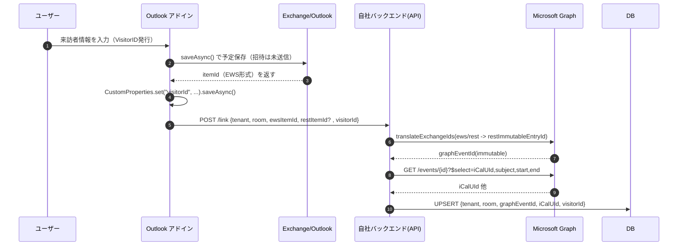
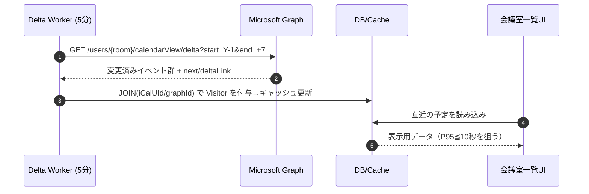

# VisitorID — Add-in × Graph Integration (Delta-only 基本構成)

> 目的：本文依存をやめ、**Compose中にID確定 → 非表示のカスタムデータ保存 → バックエンドでDB正規化**。同期は **5分 Delta**（必要に応じて通知＋Delta）。

## 責務分担（誰が何をするか）

| 層 | 責務 |
|---|---|
| **Outlook アドイン（クライアント）** | 1) `saveAsync` で itemId を確定 2) `CustomProperties` に `visitorId` を保存 3) (任意) 本文に案内行を追記（人向け） 4) **バックエンドへ POST**（`tenant, room, itemId(ews), itemId(rest?)` など） |
| **バックエンド API** | 1) `translateExchangeIds` で Graph用の **restId/immutableId** へ変換 2) (任意) `iCalUId` を取得して正規化キーを確定 3) **DB に `{tenant, room, graphEventId, iCalUId, visitorId}` をUPSERT** 4) (任意) イベントへ **Open extension** を書き込み |
| **同期ワーカー（5分 Delta）** | 1) 会議室の `calendarView/delta`（昨日〜+7日） 2) 受け取ったイベントの `id/iCalUId` で **DB JOIN** → Visitor情報を付与してキャッシュ更新 |

> 時刻整合：`Prefer: outlook.timezone="Tokyo Standard Time"` を使用。本文不要のため `Prefer: outlook.body-content-type="text"` は省略可。

## シーケンス（Compose → 保存 → 正規化）

## シーケンス（5分 Delta → キャッシュ更新）

## スロットリング/並列度
- ルーム毎に直列処理、テナント別にキュー/ワーカーを分離（相互影響を遮断）。
- `$batch` は **20/回 上限**を厳守。429 は `Retry-After` 準拠。

## 注意
- `calendarView/delta` は `?$select/$expand/$filter/$orderby/$search` **非対応**。拡張値は追加 GET または DB 参照で解決。
